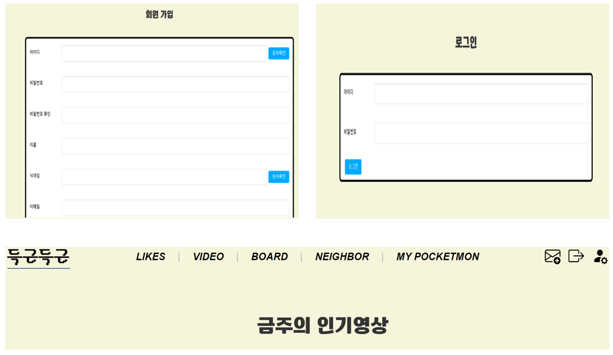
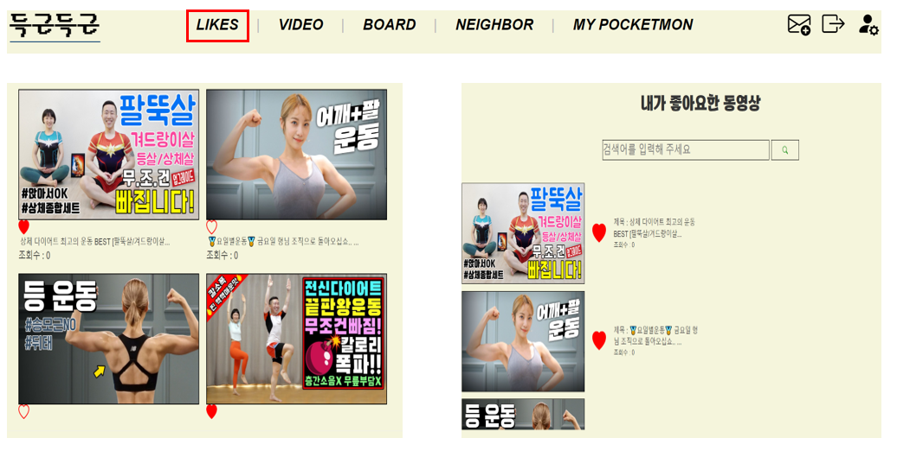
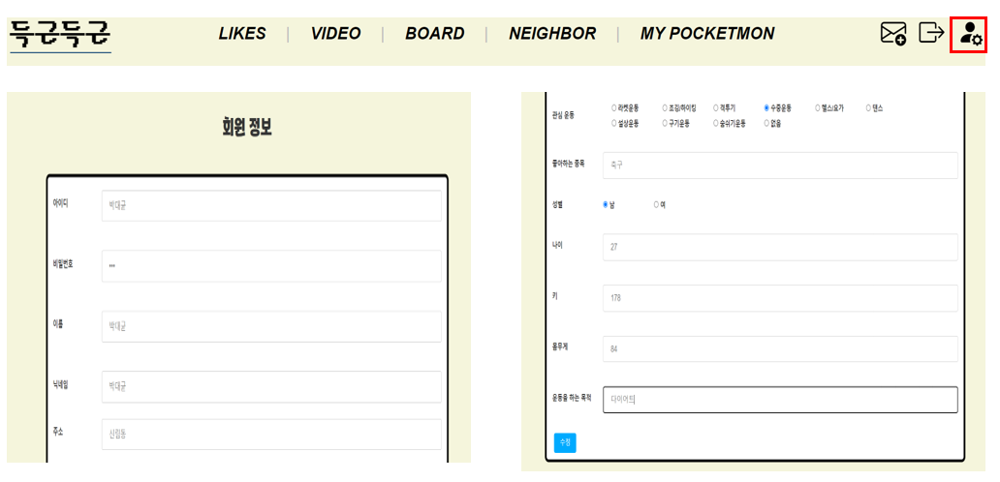
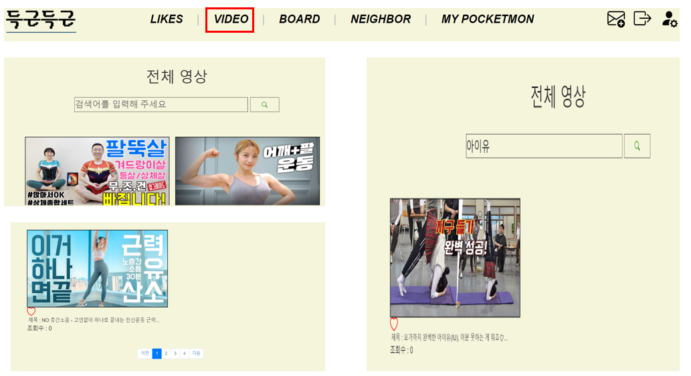
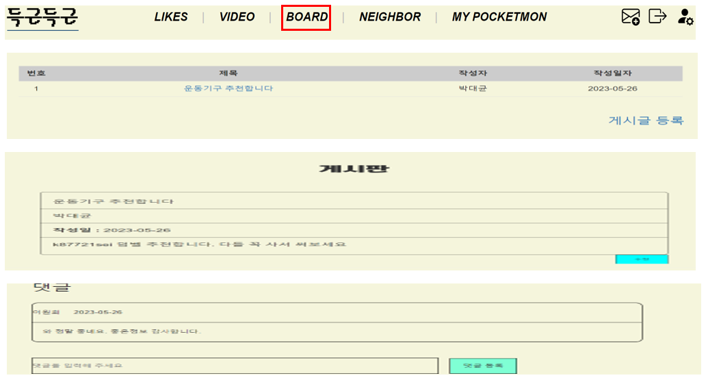
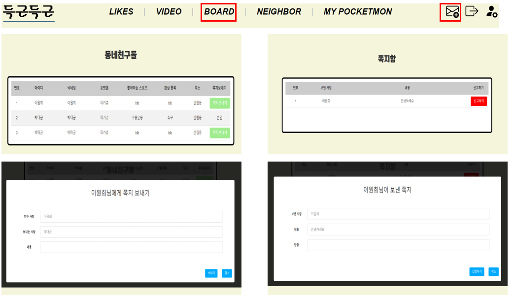
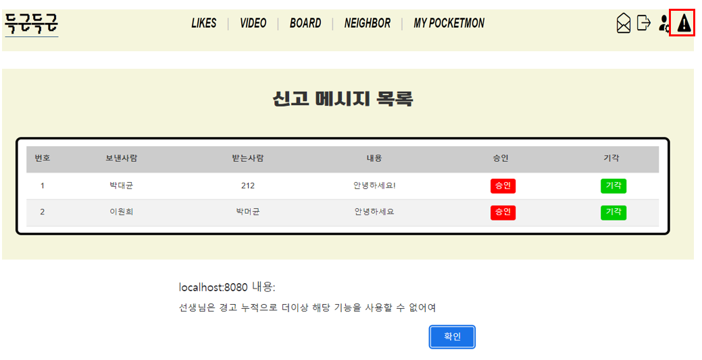
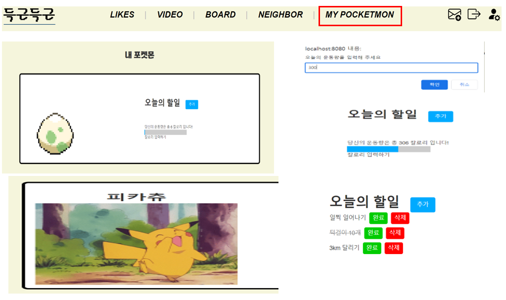

 프로젝트 코드 링크 : https://lab.ssafy.com/s09/a07/ssafy9_test/-/tree/main/FinalPJT_%EC%9D%B4%EC%9B%90%ED%9D%AC_%EB%B0%95%EB%8C%80%EA%B7%A0

## ssafy 1학기 최종 프로젝트
# 팀명 : 로켓단
 - 팀장 : 이원희
 - 팀원 : 박대균
# 프로젝트 설명
 - '득근득근'이라는 사용자들의 꾸준한 운동을 도와주는 사이트 구현

 - 기본기능
    1. 회원가입 및 로그인 기능
    2. 회원들의 게시글을 등록, 수정,삭제, 조회 기능
    3. 비디오를 시청,검색 및 '좋아요' 기능
    4. 댓글 기능

 - 심화기능 
    1. 회원별로 본인이 좋아요를 누른 영상을 모아 볼 수 있음
    2. 주변에 사는 유저와 그드르이 관심 운동을 확인하고 쪽지 할 수 있음
    3. 회원가입 시 입력한 사용자 정보를 바탕으로 본인과 어울리를 포켓몬을 매칭
    4. 사용자하 소모한 칼로리양을 통해 포켓몬을 육성

 - 관리자 기능
    1. 사용자들이 신고한 쪽지들을 확인하고 문제가 있다고 판단될 시 해당 유저의 쪽지기능을 제한할 수 있음

# 역할분담

 - 공통
    1. 프로젝트 기획 및 계획수립
    2. 목업 디자인
    3. DataBase 설계
    4. Bootstrap 활용한 디자인

 - 이원희
    1. Spring 비디오 검색, 재생 및 좋아요 기능
    2. Spring  게시글 등록 수정 삭제 댓글 기능
    3. Spring 메세지 작성 조회 기능
    4. Vue  비디오 검색 및 재생 좋아요 기능
    5. Vue 게시글 등록 수정 삭제 댓글 기능

 - 박대균 
    1. Spring 유저 및 관리자 관련 기능
    2. 클러스터링을 통한 유저와 어울리는 포켓몬 매칭
    3. Vue 유저 로그인 회원가입 기능
    4. Vue 메시지 확인,전송 및 관리자 기능
    5. 포켓몬 육성기능

# 페이지 소개
1. 메인 페이지

 
 
2. 회원가입, 로그인을 진행하면 사진과 같은 상태바가 보임

 
 
3. like 페이지로 넘아가면 자신이 좋아요를 누른 영상만을 모아 볼 수 있음

 
 
4. mypage로 이동하면 본인의 정보를 확인 할 수 있고 수정 할 수 있음

 
 
5. video로 이동을 하면 전체 영상과 검색 기능을 사용 할 수 있음

 
 
6. article로 이동하여 자유롭게 사용자들이 글을 작성, 수정, 삭제하고 댓글 작성 가능

 
 
7. neighbor로 이동하면 같은 동네 사람들이 좋아하는 운동을 볼 수 있고 쪽지 기능 가능
 
8. 쪽지함을 누르면 받은 쪽지를 확인 할 수 있으며 답장과 신고를 할 수 있음

 
 
9. 관리자는 관리자 페이지로 갈 수 있는데 여기서 신고 받은 쪽지들을 확인하고 판단 
   3번 이상의 경고를 받은 유저는 쪽지기능 사용 불가

 
 
10. 포켓몬으로 이동하면 알이 있는데 소모한 칼로리 양을 통하여 육성가능
 
일정량의 칼로리를 모으면 회원 정보를 바탕으로 약간의 랜덤성을 부여하여 어울리는 포켓몬 부화
 
11. 할일 목록을 설정하여 한 눈에 확인 가능

